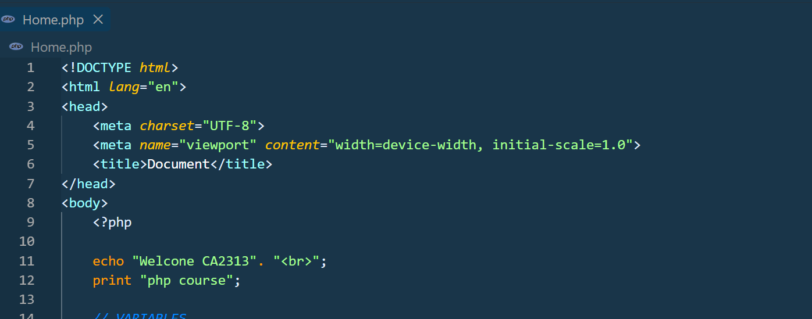
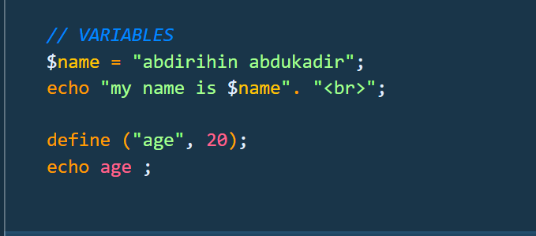
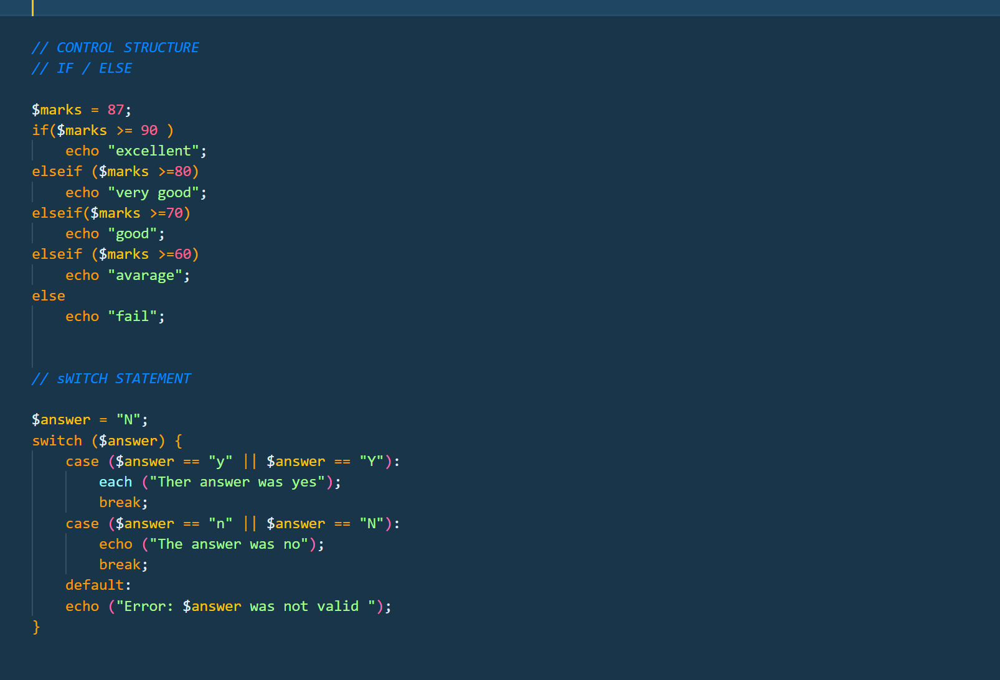
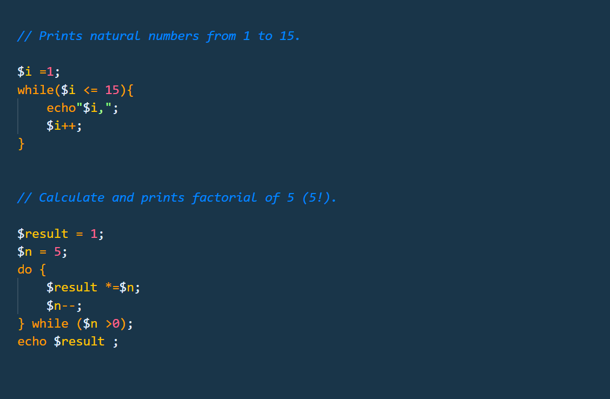

## Week 1: PHP Programming Basics

This folder contains my Week 1 practice files and screenshots demonstrating basic PHP programming concepts covered in the course Web Application Development - PHP & MySQL.

PHP Introduction Screenshots
This folder contains screenshots explaining the basic concepts of PHP in the course:

Web Application Development - PHP & MySQL 

## Screenshot Name
`echo_and_print.png`

## Description

This screenshot demonstrates how to generate output using echo and print.

Main concepts covered:

- Echo statement is used to output text from the server to your browser. 
- You can also use print statement to display text to the browser. 
- Demonstrating that echo can accept multiple arguments without parentheses.

  ## Screenshot

## Screenshot Name

`variables.png`
## Description

This screenshot demonstrates how to declare and use variables and constants in PHP.

Important points:
- Variables start with the `$` sign and are case-sensitive.
- Variables cannot start with a number or contain spaces.
- Constants are defined using the `define()` function and cannot be changed once set.

  ## Screenshot

## Screenshot Name
`control_structure.png`

## Description
This screenshot demonstrates how to use conditional statements to control the flow of the PHP script.

IF/ELSE Statement

 is used to make decisions in code. It allows a program to execute one block of code if a condition is true, and a completely different block of code if that condition is false
 

SWITCH Statement

is used to replace long, chains of if-else statement

  ## Screenshot

## Screenshot Name

`loops.png`

## Description

This screenshot demonstrates how to use loops  by executing a block of code repeatedly as long as a specified condition remains true.

WHILE LOOP

Used to repeat a block of code as long as a specific condition remains true

DO-WHILE LOOP

Used when you need a block of code to execute at least once before checking the loop's condition.

   ## Screenshot

