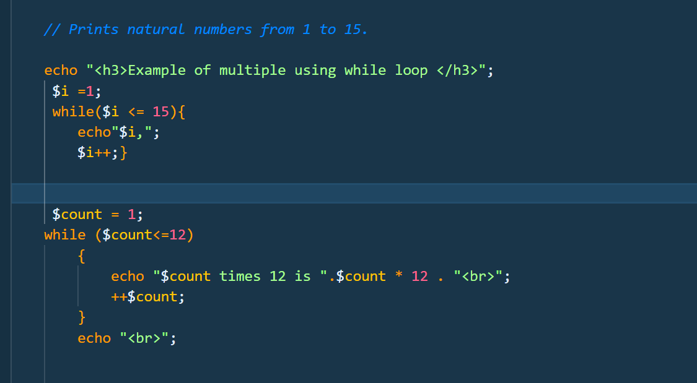
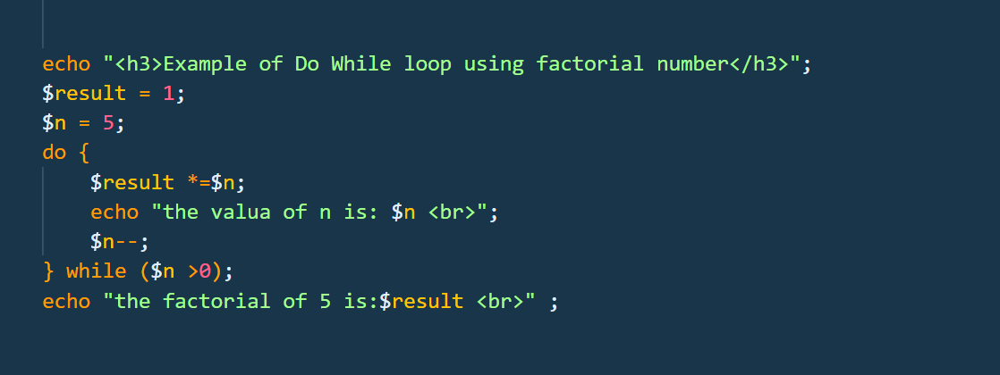
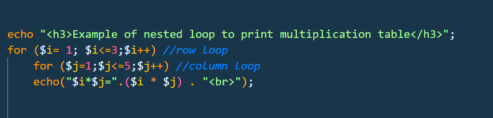
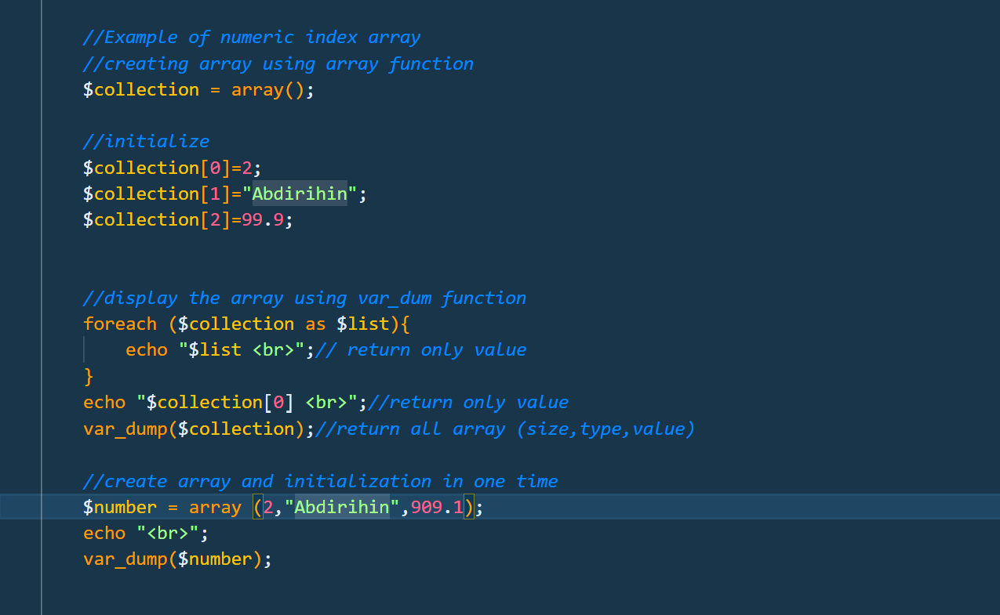
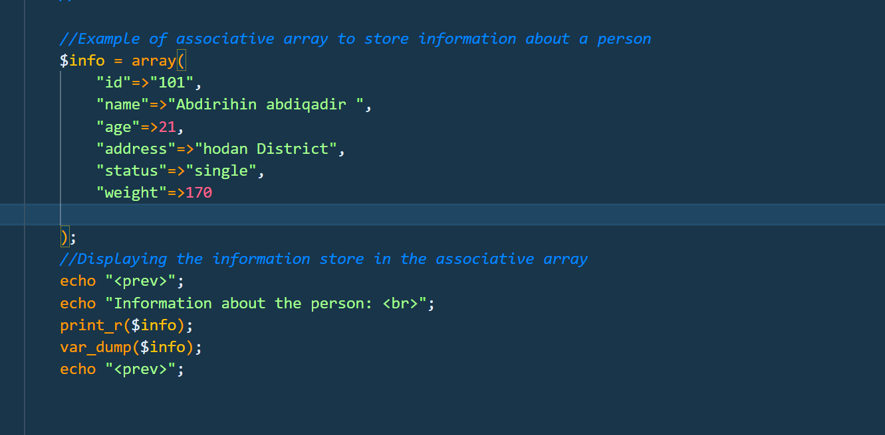

## Screenshot Name
`while_loop.png`

## Description

The while loop examples demonstrate how to repeat code while a condition is true. The examples include printing natural numbers from 1 to 15 and generating the multiplication table of 12.

- Key Points
- Uses the while loop.
- Checks the condition before executing the loop.
- Uses a counter variable.
- Uses ++ to increase the counter.
- Can be used for repeated calculations.
- Stops when the condition becomes false.

  ## Screenshot

## Screenshot Name
`do_while.png`

## Description

The do-while loop example demonstrates how to execute a block of code first and then check the condition. The example uses a factorial calculation to multiply numbers from 5 down to 1.

- Key Points
- Uses do...while.
- Executes the code at least once.
- Checks the condition after execution.
- Uses *= for multiplication.
- Uses -- to decrease the number.
- Calculates the factorial of 5 as 120.

  ## Screenshot

## Screenshot Name
`nested_loop.png`

## Description

The nested loop example demonstrates how to use one loop inside another loop. It uses two for loops to create multiplication combinations using rows and columns.

- Key Points
- Uses a for loop inside another for loop.
- The outer loop represents the rows.
- The inner loop represents the columns.
- The inner loop runs completely for each outer-loop value.
- Performs multiplication using $i * $j.

  ## Screenshot

## Screenshot Name
`numeric_array.png`

## Description

The numeric array examples demonstrate how to store and access multiple values using numeric indexes. The examples also show how to display array values using foreach, var_dump(), and direct index access.

- Key Points
- Uses numeric indexes such as 0, 1, and 2.
- Stores multiple values in one array.
- Uses foreach to display each value.
- Uses $collection[0] to access a specific value.
- Uses var_dump() to display detailed array information.
- Can create and initialize an array at the same time.

  ## Screenshot

## Screenshot Name
`associative_array.png`

## Description

The associative array example demonstrates how to store related information using named keys instead of numeric indexes. It stores information about a person, such as ID, name, age, address, status, and weight.

- Key Points
- Uses key-value pairs.
- Uses meaningful keys such as "name" and "age".
- Makes data easier to understand and access.
- Uses print_r() to display array contents.
- Uses var_dump() to display detailed information.

  ## Screenshot

