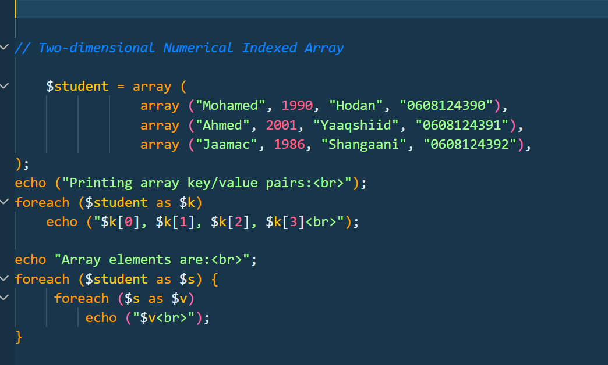
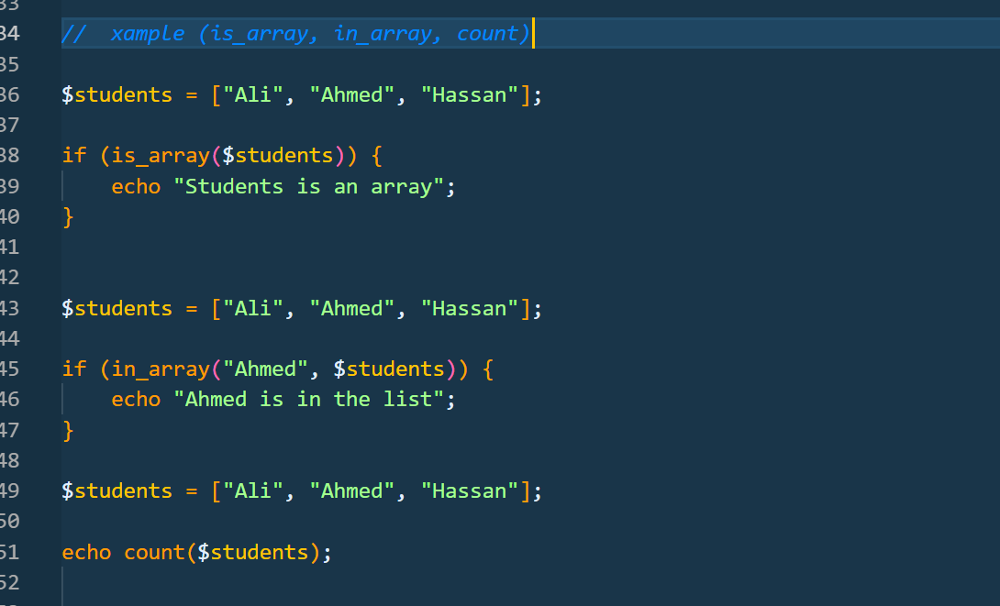
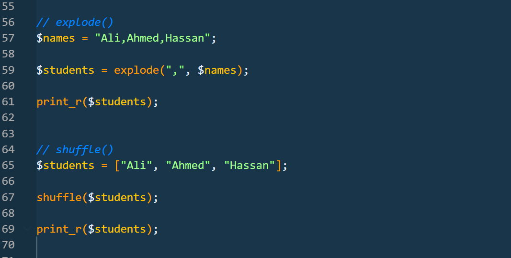
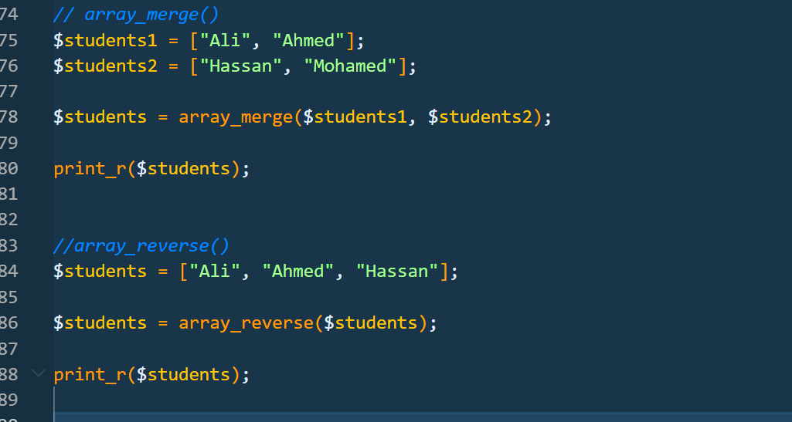
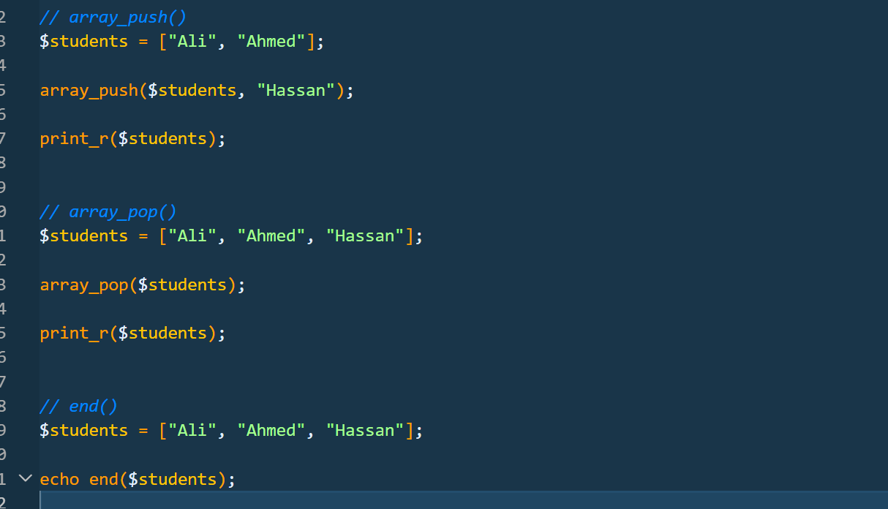

## Screenshot Name
`Two-dimensional-array.png`

## Description

This example demonstrates how to create and display a two-dimensional numeric indexed array. The array stores information about multiple students, where each student has several values such as name, birth year, district, and phone number.

**Key Points**
- Uses a two-dimensional array.
- The main array contains multiple smaller arrays.
- Each student has four values.
- Uses numeric indexes such as 0, 1, 2, and 3.
- The first foreach displays each student's information in one line.
- The nested foreach displays each value separately.
- $k[0], $k[1], $k[2], $k[3] access values from each student.
- The inner foreach is used to go through all values inside each student array.

  ## Screenshot

## Screenshot Name
`Array-Functions.png`

## Description

These examples demonstrate some common PHP array functions used to check whether a variable is an array, search for a value inside an array, and count the number of elements in an array.

**Key Points**
- is_array() → Checks if a variable is an array.
- in_array() → Checks if a specific value exists inside an array.
- count() → Counts the number of elements in an array.
- The examples use a $students array containing student names.

  ## Screenshot

## Screenshot Name
`Explode-Shuffle-function.png`

## Description

These examples demonstrate how to split a string into an array using explode() and how to randomly change the order of array elements using shuffle().

**Key Points**
- explode() → Converts a string into an array using a separator.
- shuffle() → Randomly changes the order of values in an array.
- print_r() → Displays the contents of the array.

  ## Screenshot

## Screenshot Name
`Array_Merge-Array_Reverse.png`

## Description

These examples demonstrate how to combine two or more arrays into one array using array_merge() and how to reverse the order of array elements using array_reverse().

**Key Points**
- array_merge() → Combines two or more arrays into one array.
- array_reverse() → Reverses the order of elements in an array.
- print_r() → Displays the contents of the array.

  ## Screenshot

## Screenshot Name
`array_push_array_pop_end.png`

## Description

These examples demonstrate how to add an element to an array, remove the last element from an array, and get the last element of an array.

**Key Points**
- array_push() → Adds a new value to the end of an array.
- array_pop() → Removes the last value from an array.
- end() → Returns the last value of an array.
- print_r() → Displays the array contents.

  ## Screenshot

